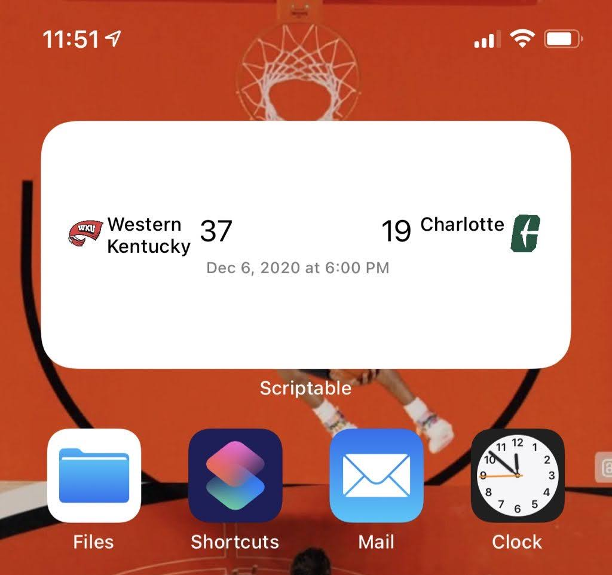
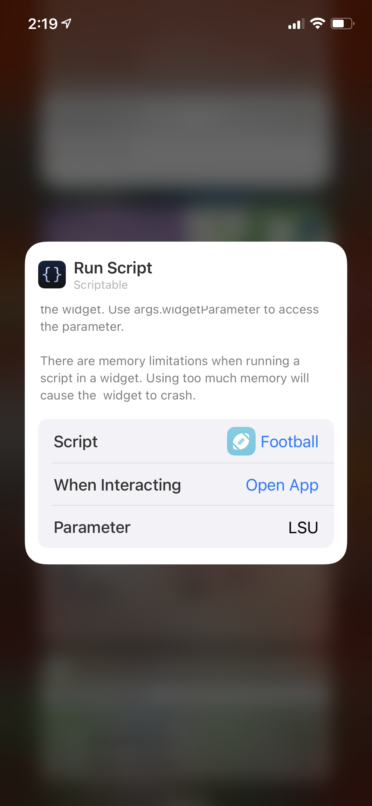

# CFBWidget

CFBWidget is a scriptable made widget that allows you to quickly look at your favorite college football team latest score from your IOS home screen. 

## Installation 

Choose your team from the following List:
- Abilene Christian
- Adams State
- Adrian
- Air Force
- Akron
- Alabama
- Alabama A&M
- Alabama State
- Albany
- Albany State (GA)
- Albion
- Albright
- Alcorn State
- Alderson-Broaddus
- Alfred
- Alfred State College
- Allegheny
- Alma College
- American International
- Amherst College
- Anderson (IN)
- Angelo State
- Anna Maria College
- Appalachian State
- Apprentice School
- Arizona
- Arizona Christian
- Arizona State
- Arkansas
- Arkansas-Monticello
- Arkansas-Pine Bluff
- Arkansas State
- Arkansas Tech
- Army
- Ashland
- Assumption
- Auburn
- Augsburg
- Augustana (IL)
- Augustana (SD)
- Aurora
- Austin College
- Austin Peay
- Ave Maria
- Averett
- Avila College
- Azusa Pacific
- Bacone College
- Baker University
- Baldwin-Wallace
- Ball State
- Bates College
- Baylor
- Becker College
- Beloit College
- Bemidji State
- Benedict College
- Benedictine College
- Benedictine (IL)
- Bentley
- Berry College
- Bethany (KS)
- Bethany (WV)
- Bethel (MN)
- Bethel (TN)
- Bethune-Cookman
- Birmingham-Southern
- Blackburn
- Black Hills State
- Bloomsburg
- Bluefield College
- Bluffton
- Boise State
- Boston College
- Bowdoin
- Bowling Green
- Brevard College
- Bridgewater State
- Bridgewater (VA)
- Brit Columbia
- Brockport State (NY)
- Brown
- Bryant
- Bucknell
- Buena Vista
- Buffalo
- Buffalo State
- Butler
- BYU
- California
- California (PA)
- Cal Lutheran
- Cal Poly
- Campbell
- Capital
- Carleton
- Carnegie Mellon
- Carroll (WI)
- Carson-Newman
- Carthage
- Case Western Reserve
- Castleton State College
- Catawba
- Catholic University
- Central
- Central Arkansas
- Central Connecticut
- Central Methodist
- Central Michigan
- Central Missouri State
- Central Oklahoma
- Central State
- Central Washington
- Centre
- Chadron State
- Chapman
- Charleston Southern
- Charleston (WV)
- Charlotte
- Chattanooga
- Cheyney
- Chicago
- Christopher Newport
- Cincinnati
- Claremont
- Clarion
- Clark Atlanta
- Clemson
- Coastal Carolina
- Coast Guard
- Coe
- Colby
- Colgate
- College of Faith
- College of Faith - Charlotte
- College of Idaho
- College of New Jersey
- Colorado
- Colorado College
- Colorado Mesa
- Colorado Mines
- Colorado State
- Colorado State-Pueblo
- Columbia
- Concord
- Concordia (AL)
- Concordia College (MI)
- Concordia (IL)
- Concordia (MN)
- Concordia-St. Paul
- Concordia (WI)
- Connecticut
- Cornell
- Cornell College (IA)
- Crown College
- Culver-Stockton
- Cumberland
- Cumberland College
- Curry
- Dakota State
- Dakota Wesleyan
- Dartmouth
- Davidson
- Dayton
- Defiance
- Delaware
- Delaware State
- Delaware Valley
- Delta State
- Denison
- DePauw
- Dickinson
- Dickinson State
- Drake
- Dubuque
- Duke
- Duquesne
- Earlham
- East Carolina
- East Central
- Eastern Illinois
- Eastern Kentucky
- Eastern Michigan
- Eastern New Mexico
- Eastern Oregon
- Eastern Washington
- East Stroudsburg
- East Tennessee State
- East Texas Baptist
- Edinboro
- Elizabeth City State
- Elmhurst
- Elon
- Emory & Henry
- Emporia State
- Endicott College
- Erie Community College
- Eureka College
- Evangel
- Fairmont State
- Faulkner
- Fayetteville State
- FDU-Florham
- Ferris State
- Ferrum
- Findlay
- Fitchburg State
- Florida
- Florida A&M
- Florida Atlantic
- Florida International
- Florida State
- Florida Tech
- Fordham
- Fort Hays State
- Fort Lewis
- Fort Valley State
- Framingham State
- Franklin
- Franklin & Marshall
- Fresno State
- Frostburg State
- Furman
- Gallaudet
- Gannon
- Gardner-Webb
- Geneva College
- George Fox University
- George Mason
- Georgetown
- Georgia
- Georgia Southern
- Georgia State
- Georgia Tech
- Gettysburg
- Glenville State
- Graceland University
- Grambling
- Grand Valley State
- Greensboro
- Greenville
- Grinnell
- Grove City College
- Guilford
- Gustavus Adolphus
- Hamilton
- Hamline
- Hampden-Sydney
- Hampton
- Hanover
- Harding
- Hardin-Simmons
- Hartwick
- Harvard
- Haskell Indian Nations
- Hawai'i
- Heidelberg
- Henderson State
- Hendrix College
- Hillsdale
- Hiram
- Hobart
- Holland College
- Holy Cross
- Hope
- Houston
- Houston Baptist
- Howard
- Howard Payne
- Humboldt State
- Huntingdon
- Husson
- Idaho
- Idaho State
- Illinois
- Illinois College
- Illinois State
- Illinois Wesleyan
- Incarnate Word
- Indiana
- Indiana (PA)
- Indianapolis
- Indiana State
- Iowa
- Iowa State
- Iowa Wesleyan
- Ithaca
- Jackson State
- Jacksonville
- Jacksonville State
- James Madison
- Jamestown
- John Carroll
- Johns Hopkins
- Johnson C Smith
- Juniata
- Kalamazoo
- Kansas
- Kansas State
- Kansas Wesleyan University
- Kennesaw State
- Kent State
- Kentucky
- Kentucky State
- Kentucky Wesleyan
- Kenyon
- King's College (PA)
- Kutztown
- Lafayette
- LaGrange College
- Lake Erie College
- Lake Forest
- Lamar
- Lambuth
- Langston
- La Verne
- Lawrence
- Lebanon Valley
- Lehigh
- Lenoir-Rhyne
- Lewis & Clark
- Liberty
- Limestone
- Lincoln (MO)
- Lincoln (PA)
- Lindenwood
- Lindenwood Belleville
- Lindsey Wilson
- Linfield
- LIU Post
- Livingstone
- Lock Haven
- Louisiana
- Louisiana College
- Louisiana Monroe
- Louisiana Tech
- Louisville
- LSU
- Luther
- Lycoming
- Macalester
- MacMurray College
- Maine
- Maine Maritime
- Malone
- Manchester
- Manitoba
- Mansfield
- Maranatha Baptist College
- Marian
- Marietta
- Marist
- Marshall
- Mars Hill
- Martin Luther College
- Mary Hardin-Baylor
- Maryland
- Maryville TN
- Mass Maritime
- Mayville State
- McDaniel College
- McMurry
- McNeese
- Memphis
- Menlo
- Mercer
- Merchant Marine
- Mercyhurst
- Merrimack
- Methodist
- Miami
- Miami (OH)
- Michigan
- Michigan State
- Michigan Tech
- Middlebury
- Middle Tennessee
- Midland University
- Midwestern State
- Miles
- Millersville
- Millikin
- Millsaps
- Minnesota
- Minnesota-Crookston
- Minnesota-Duluth
- Minnesota-Morris
- Minnesota State
- Minnesota St-Moorhead
- Minot State
- Misericordia
- Mississippi College
- Mississippi State
- Mississippi Valley State
- Missouri
- Missouri Baptist
- Missouri Southern State
- Missouri S&T
- Missouri State
- Missouri Western
- Monmouth
- Monmouth (IL)
- Montana
- Montana State
- Montana-Western
- Montclair State
- Monterrey Tech
- Moravian
- Morehead State
- Morehouse
- Morgan State
- Morningside
- Morrisville State
- Mount Ida College
- Mount St. Joseph
- Mount Union
- Muhlenberg
- Murray State
- Muskingum
- Navy
- NC State
- NC Wesleyan
- Nebraska
- Nebraska-Kearney
- Nebraska-Omaha
- Nevada
- Newberry
- New Hampshire
- New Haven
- New Mexico
- New Mexico Highlands
- New Mexico State
- Nicholls
- Nichols
- Norfolk State
- North Alabama
- North Carolina
- North Carolina A&T
- North Carolina Central
- North Central
- North Dakota
- North Dakota State
- Northeastern State
- Northern Arizona
- Northern Colorado
- Northern Illinois
- Northern Iowa
- Northern Michigan
- Northern State
- North Greenville
- North Park
- North Texas
- Northwestern
- Northwestern (MN)
- Northwestern Oklahoma State
- Northwestern State
- Northwest Missouri State
- Northwood (MI)
- Norwich
- Notre Dame
- Notre Dame College
- Oberlin
- Occidental
- Ohio
- Ohio Dominican
- Ohio Midwestern College
- Ohio Northern
- Ohio State
- Ohio State Newark
- Ohio Wesleyan
- Oklahoma
- Oklahoma Baptist
- Oklahoma State
- OK Panhandle St
- Old Dominion
- Ole Miss
- Olivet College
- Oregon
- Oregon State
- Otterbein
- Ouachita Baptist
- Pace
- Pacific Lutheran
- Pacific (OR)
- Penn State
- Pennsylvania
- Pikeville
- Pittsburgh
- Pittsburg State
- Plymouth State
- Point University
- Pomona-Pitzer
- Portland State
- Prairie View
- Presbyterian College
- Presentation College
- Princeton
- Principia College
- Puget Sound
- Purdue
- Quincy
- Randolph-Macon
- Redlands
- Reinhardt
- Rensselaer
- Rhode Island
- Rhodes
- Rice
- Richmond
- Ripon
- Robert Morris
- Robert Morris (IL)
- Rochester
- Rockford
- Rose-Hulman
- Rowan
- Rutgers
- Sacramento State
- Sacred Heart
- Saginaw Valley
- Salisbury
- Salve Regina
- Samford
- Sam Houston State
- San Diego
- San Diego State
- San José State
- Savannah State
- Seton Hill College
- Sewanee Univ. of the South
- Shaw
- Shenandoah
- Shepherd
- Shepherd Tech
- Shippensburg
- Siena Heights
- Simon Fraser
- Simpson College
- Slippery Rock
- SMU
- South Alabama
- South Carolina
- South Carolina State
- South Dakota
- South Dakota Mines
- South Dakota State
- Southeastern Louisiana
- Southeastern Oklahoma
- Southeastern University
- Southeast Missouri State
- Southern
- Southern Arkansas
- Southern Connecticut State
- Southern Illinois
- Southern Mississippi
- Southern Nazarene
- Southern Oregon
- Southern Utah
- Southern Virginia
- South Florida
- Southwest Baptist
- Southwestern Assemblies of God
- Southwestern College
- Southwestern Oklahoma
- Southwest Minnesota State
- Springfield
- St. Ambrose
- Stanford
- St. Anselm
- St. Augustine's
- St. Cloud State
- Stephen F. Austin
- Sterling College
- Stetson
- Stevenson
- St. Francis (IL)
- St. Francis (IN)
- St Francis (PA)
- St. John Fisher
- St. Johns (MN)
- St Lawrence
- St. Norbert
- St. Olaf College
- Stonehill
- Stony Brook
- St. Paul's College
- St. Peter's
- St. Scholastica
- St. Thomas (MN)
- St. Vincent
- St. Xavier (IL)
- Sul Ross State
- SUNY Cortland
- SUNY Maritime
- Susquehanna
- Syracuse
- Tarleton State
- TCU
- Temple
- Tennessee
- Tennessee State
- Tennessee Tech
- Texas
- Texas A&M
- Texas A&M-Commerce
- Texas A&M-Kingsville
- Texas College
- Texas Lutheran
- Texas Southern
- Texas State
- Texas Tech
- The Citadel
- Thomas More
- Tiffin
- Toledo
- Towson
- Trine
- Trinity Bible
- Trinity (CT)
- Trinity (IL)
- Trinity (TX)
- Troy
- Truman State
- Tufts
- Tulane
- Tulsa
- Tusculum
- Tuskegee
- UAB
- UC Davis
- UCF
- UCLA
- UMass
- UMass Dartmouth
- UMass Lowell
- UNC Pembroke
- Union
- University of Faith
- UNLV
- Upper Iowa
- Urbana
- Ursinus
- USC
- Utah
- Utah State
- UTEP
- Utica
- UT Martin
- UT San Antonio
- UVA-Wise
- UW-Oshkosh
- UW-River Falls
- UW-Stout
- UW-Whitewater
- Valdosta State
- Valley City State
- Valparaiso
- Vanderbilt
- Villanova
- Virginia
- Virginia State
- Virginia Tech
- VMI
- Wabash College
- Wagner
- Wake Forest
- Waldorf
- Walsh
- Warner
- Wartburg
- Washburn
- Washington
- Washington & Jefferson
- Washington & Lee
- Washington (MO)
- Washington State
- Wayland Baptist
- Waynesburg
- Wayne State (MI)
- Wayne State (NE)
- Webber International
- Weber State
- Wesleyan
- Wesley College
- West Alabama
- West Chester
- Western Carolina
- Western Connecticut State
- Western Illinois
- Western Kentucky
- Western Michigan
- Western New England
- Western New Mexico
- Western Oregon
- Western State
- Western Washington
- Westfield State
- West Florida
- West Georgia
- West Liberty
- Westminster
- Westminster PA
- West Texas A&M
- West Virginia
- West Virginia Tech
- Wheaton College (Ill)
- Whittier
- Whitworth
- Widener
- Wilkes
- Willamette
- William Jewell College
- William & Mary
- William Paterson
- William Penn
- Williams
- Williamson Trade
- Wilmington (OH)
- Wingate
- Winona State
- Winston-Salem
- Wisconsin
- Wisconsin-Eau Claire
- Wisconsin-La Crosse
- Wisconsin Lutheran
- Wisconsin-Platteville
- Wisconsin-Stevens Point
- Wittenberg
- Wofford
- Wooster
- Worcester Polytechnic
- Worcester State College
- Wright State University
- WV State
- WV Wesleyan
- Wyoming
- Yale
- Youngstown State
- 10th District A.C.
- 111th Ambulance
- 11th Cavalry
- 1st Infantry
- 1st Texas Artillery
- 20th Infantry
- 260th Coast Artillery
- 26th Infantry
- 2nd Developmemt Regiment
- 2nd Texas 132nd Infantry
- 362nd Infantry
- 3rd Army Corps
- 47th Infantry
- 48th Infantry
- 7th Infantry
- 9th Amry Corps
- Abilene Field
- Active Football Club
- Actual Business College
- Adelbert
- Adelphi
- Alabama Medical
- Alabama Presbyterian
- Alabama Southern
- Alameda Coast Guard
- Alameda NAS
- Albertson
- Albuquerque Field
- Alliance
- Alma
- Altoona A.C.
- Amarillo Field
- American
- American Legion
- American Medical
- American Osteopath
- Amherst YMCA
- Anaconda Anodes
- Anderson
- Andover
- Arizona All-Stars
- Armour
- Army Ambulance Corps
- Athens
- Athens A.C.
- Atlantic Christian
- Atlantic City NAS
- Augusta Military Academy
- Augustana (South Dakota)
- Austin
- Austin High
- Bailey Military
- Bainbridge NTS
- Baker
- Balboa NTS
- Ballard Meteors
- Baltimore
- Baltimore A.C.
- Bankers A.C.
- Barksdale Field
- Barnes Medical
- Barron Field
- Beaumont Hospital
- Belhaven College
- Bellefonte Academy
- Bellevue
- Belmont A.C.
- Beloit High
- Benedict
- Bennett Medical
- Berg Field
- Bergstrom Field
- Berkeley A.C.
- Bethany (Kansas)
- Bethany (West Virginia)
- Bethel
- Bingham
- Birmingham
- Birmingham High
- Bishop
- Blackland Field
- Blountsville Agricultural
- Bogue Field
- Bolling Field
- Boston A.C.
- Boston English High
- Boston Latin High
- Boston University
- Boulder High
- Bowie State
- Bradford National Guard
- Bradley
- Brandeis
- Brayton
- Bremerton Navy
- Bridgewater
- Britannia
- British Club of New York
- Brooklyn
- Brooklyn Polytechnic Institute
- Brooklyn Tigers (NFL)
- Bryan Field
- Bryson
- Buckner Business College
- Bunker Hill Navy
- Burleson
- Burlingame A.C.
- Butler YMCA
- Butte A.C.
- California Alumni
- California (Pennsylvania)
- California-Riverside
- California-Santa Barbara
- California Tech
- Cal Poly-Pomona
- Cal State Fullerton
- Cal State Los Angeles
- Cal State Northridge
- Camp Adams
- Camp Baker
- Camp Beale
- Camp Blanding
- Camp Davis
- Camp Devens
- Camp Dodge
- Camp Doniphan
- Campello
- Camp Funston
- Camp Gordon
- Camp Grant
- Camp Greene
- Camp Greenleaf
- Camp Griffin
- Camp Haan
- Camp Hancock
- Camp Harrison
- Camp Hood
- Camp Humphreys
- Camp Kilmer
- Camp Lee
- Camp Lejeune
- Camp Logan
- Camp Lyons
- Camp Mabry
- Camp MacAurthur
- Camp MacDowell
- Camp Mackall
- Camp McClelland
- Camp McKinley
- Camp McPherson
- Camp Meyer
- Camp Peary
- Camp Pendleton
- Camp Perry
- Camp Pickett
- Camp Pike
- Camp Polk
- Camp Preble
- Camp Russell
- Camp Sevier
- Camp Shelby
- Camp Sherman
- Camp Taylor
- Camp Travis
- Camp Wadsworth
- Canada All-Stars
- Canisius
- Canton A.C.
- Carleton-St. Olaf
- Carlisle
- Carlstrom Field
- Carroll (Montana)
- Carroll (Wisconsin)
- Carruthers Field
- Carswell AFB
- Casa Blanca Indians
- Case
- Castle Heights
- Catawba College
- Catholic
- Centenary (LA)
- Centerville (Butte)
- Central Academy
- Central (Iowa)
- Central (Kentucky)
- Chamberlain Hunt
- Chanute Field
- Charles City
- Charleston
- Charleston Coast Guard
- Charleston Navy
- Chatham Field
- Chemawa
- Cherry Point Marines
- Cheyenne High
- Chicago A.C.
- Chicago Alumni
- Chicago College
- Chicago Dental
- Chicago Dining Club
- Chicago Medical
- Chicago Naval Reserve
- Chicago YMCA
- Chick Springs Military
- Chilocco
- Chowan
- Christian Brothers
- City College of New York
- Clarke Memorial
- Clarkson
- Clemson Freshmen
- Cleveland Naval Reserves
- C.M.T.S.
- College All-Stars
- Colorado Alumni
- Colorado College Alumni
- Colorado Springs Field
- Colorado Springs High
- Colorado State Freshmen
- Columbia A.C.
- Columbia Alumni
- Columbia College
- Columbia Law
- Columbia (Oregon)
- Columbia YMCA
- Company I
- Connecticut Literary
- Connecticut-Waterbury
- Conway Hall
- Corpus Christi NAS
- Cortland State
- Cotton City A.C.
- Crane J.C.
- Creighton
- Crescent A.C.
- Culver
- Curtis Bay Coast Guard
- Dalhart Field
- Dallas
- Daniel Baker
- Daniel Field
- Davis & Elkins
- Dean Academy
- Decatur Baptist
- Del Monte Pre-Flight
- Denver
- Denver A.C.
- Denver Alumni
- Denver Freshmen
- Denver Manual High
- DePaul
- Des Moines
- Des Moines Baptist
- Detroit A.C.
- Detroit Mercy
- Dickinson Seminary
- Dixie
- Dixie State
- Dixon
- Doane
- Drake Alumni
- Drexel
- Drury
- Duquesne A.C.
- East Central Oklahoma
- East Denver High
- East Des Moines High
- Eastern Arizona J.C.
- Eastern (Virginia)
- Edmond Tech
- Edmonton Field
- Edward Waters
- Elgin Academy
- Elizabeth A.C.
- Ellensburg
- Ellington Field
- Ellsworth
- El Paso National Guard
- El Toro Marines
- Emporia College
- Englewood
- Englewood High
- Englewood YMCA
- Erskine
- Eton
- Eureka
- Evanston High
- Evansville
- Exeter
- F.A.A.
- Fall River
- Falls of Schuylkill
- Farragut Navy
- Finlandia University
- Fishburne M.A.
- Fitchburg YMCA
- Fleet City
- Florence YMCA
- Florida Southern
- Fort Benning
- Fort Bliss
- Fort Bragg
- Fort Des Moines
- Fort Douglas
- Fort Ethan Allen
- Fort Jackson
- Fort Knox
- Fort Leavenworth
- Fort Lewis College
- Fort Monmouth
- Fort Monroe
- Fort Oglethorpe
- Fort Ord
- Fort Pierce
- Fort Riley
- Fort Sheridan
- Fort Totten
- Fort Warren
- Fort Worth
- Foundation
- Frederick
- Freeport High
- Fremont Ammuntion
- Fresno State JV
- Friends
- Galveston Field
- Garden City
- Geneva
- Georgetown (Kentucky)
- George Washington
- Georgia B
- Georgia Medical
- Georgia Pre-Flight
- Georgia Tech B
- Goat Island Navy
- Golden High
- Gonzaga
- Gonzaga Alumni
- Gordon
- Goshen
- Grand Island
- Grand Rapids High
- Granite High
- Great Lakes Navy
- Greenfield
- Greensboro Field
- Greenville Field
- Greer
- Grinnell Alumni
- Grinnell High
- Grove City
- Hahnemann Medical
- Hamilton A.C.
- Hampton A.C.
- Hampton Road
- Harrisburg A.C.
- Harry Hillman Academy
- Hartford
- Harvard Alumni
- Harvard B
- Harvard Freshmen
- Harvard Law
- Haskell
- Hastings
- Hastings State
- Havana A.C.
- Havana University
- Haverford
- Hawaii All-Stars
- Hayward State
- Hebron Academy
- Hedding
- Herington Field
- Highland Park
- High Point
- Hiwassee
- Hoboken Navy
- Hofstra
- Homestead A.C.
- Hondo Field
- Hopkinson
- Horner
- Houston YMCA
- Hyde Park
- Hyde Park High
- Idaho Marines
- Illinois Alumni
- Illinois Cycling Club
- Illinois Medical
- Independence A.C.
- Indiana Alumni
- Indiana Medical
- Indiana (Pennsylvania)
- Indianapolis Artillery
- Intermountain
- Iowa Pre-Flight
- Jackson Br.-New Orleans
- Jackson Field
- Jacksonville Naval Air Station
- James Millikin
- Jefferson
- Jefferson Medical
- Jersey Shore
- Kamehameha Alumni
- Kansas City A.C.
- Kansas City Medical
- Kansas City Veterinary
- Kansas Wesleyan
- Kean
- Kearney
- Kearney Field
- Keesler Field
- Kelly Field
- Kents Hill
- Kentucky Christian
- King
- Kingfisher
- King George
- Kirtland Field
- Kiski Preparatory
- Knox College
- Lackland Field
- Lake Forest Academy
- Lake Forest Alumni
- Lakehurst NAS
- Lakeland University
- Lake View High
- Lancaster Crescents
- Lane
- Lanier
- Laramie High
- La Salle
- Latrobe A.C.
- Laureate Boat Club
- Lawrenceville
- Lawton
- League Island Navy
- Leander Clarke
- Lehigh A.C.
- Leilahau
- Lewisburg A.C.
- Lieutenants
- Lincoln
- Lincoln Field
- Lincoln High
- Lincoln Medical
- Locust Grove
- Logan All-Stars
- Lombard
- Long Beach State
- Longmont High
- Loras
- Loras College
- Los Angeles A.C.
- Los Angeles Junior College
- Louisiana Army STU
- Louisiana State Freshmen
- Louisville Field
- Love Field
- Lowry Field
- Loyola Academy
- Loyola (Baltimore)
- Loyola (Chicago)
- Loyola (LA)
- Loyola Marymount
- Lubbock Field
- Lynchburg
- MacAurthur Field
- Machinists Mates
- Madison High
- Manhattan
- Manhattan A.C.
- Manhattan Beach Coast Guard
- Mankato State
- Manual Training High
- March Field
- Mare Island Marines
- Mare Island Navy
- Marine Officers
- Marion
- Marion County High
- Marion Sims
- Marquette
- Marshall School
- Marshalltown
- Maryland A.C.
- Maryland-Baltimore
- Massilon A.C.
- Mather Field
- Maxwell Field
- Mayport NAS
- McClellan Field
- McDaniel
- McGill
- McKendree
- Medford A.C.
- Medico-Chirurgical
- Melville PT Boats
- Memphis High
- Memphis Navy
- Mercersburg Academy
- Meridian
- Meteor A.C.
- Michigan A.C.
- Michigan Military Academy
- Midwestern Texas State
- Milligan
- Milwaukee Medical
- Minneapolis Boat Club
- Minneapolis Central High
- Minneapolis Eastern High
- Minneapolis South High
- Minnesota Alumni
- Missouri-Kansas City
- Missouri-Rolla
- Missouri Southern
- Missouri Valley
- Missouri Wesleyan
- MIT
- Moffett Field
- Mohawk
- Moline A.C.
- Monroe A.C.
- Montana Tech
- Montana Wesleyan
- Montclair A.C.
- Montezuma
- Montgomery A.C.
- Monticello Navy
- Montreal
- Mooney
- Moorhead State
- Morgan
- Morganton Mutes
- Morris Field
- Morris Harvey
- Mount Airy Deaf School
- Mount Carmel All-Stars
- Mount Hermon
- Mount Pleasant
- Mount St. Mary's
- Multnomah A.C.
- Nashville
- Navy Hospital Corps
- Navy Reserves
- Navy Transport
- Nebraska Alumni
- Nebraska Wesleyan
- Nebraska Wesleyan University
- Needham
- Newark A.C.
- Newberry A.C.
- Newburyport A.C.
- New England All-Stars
- New Jersey A.C.
- New London Submarine Base
- New Mexico Military
- New Mexico Tech
- New Orleans Gym Club
- Newport Navy
- Newport News
- Newport NTS
- Newton A.C.
- Newton High
- Newtowne A.C.
- New York A.C.
- New York Law
- New York Naval Militia
- New York State
- New York University
- Niagara
- Norfolk A.C.
- Norfolk Blues
- Norfolk Fire Department
- Norfolk Marines
- Norfolk Navy
- Norfolk Navy Base
- Norfolk Navy Yard
- Norman Naval Air Station
- Norman Park
- North Alabama A.C.
- North Carolina Medical
- North Carolina Pre-Flight
- North Dakota Teachers
- North Denver High
- North Division High
- Northeastern
- Northeastern Oklahoma State
- North Georgia
- Northwest Division High
- Northwestern Academy
- Northwestern Alumni
- Northwestern Dental
- Northwestern (Wisconsin)
- Notre Dame B
- Oak Ridge
- Oceana NAS
- Ogden A.C.
- Ogden High
- Oglethorpe
- Ohio Am. Corp.
- Ohio Medical
- Oklahoma City
- Oklahoma Mines
- Oklahoma Teachers
- Olathe Navy
- Olivet
- Olympic A.C.
- Olympic Club
- Omaha Balloon
- Omaha Light Guards
- Onondaga
- Orange A.C.
- Oregon College
- Oregon State Alumni
- Originals A.C.
- Ottawa
- Ottumwa Pre-Flight
- Ouachita
- Overland Station
- Ozarks
- Pacific
- Pacific All-Stars
- Pacific Fleet
- Pacific (Oregon)
- Pacific Submarines
- Palmyra
- Panhandle State
- Panora
- Park Field
- Parris Island Marines
- Parsons
- Parsons (Iowa)
- Pastime A.C.
- Payne Field
- Pearl Harbor
- Pelham Bay Navy
- Penn Radio School
- Pennsylvania Alumni
- Pennsylvania College
- Pennsylvania Military
- Pennsylvania Railroad YMCA
- Pennsylvania Reserves
- Pensacola A.C.
- Pensacola NAS
- Peoria Socials A.C.
- Pepperdine
- Peru State
- Phialdelphia YMCA
- Philadelphia A.C.
- Philadelphia All-Stars
- Philadelphia Naval Yard
- Phillips
- Phoenix A.C.
- Phoenix All-Stars
- Phoenix Indians
- Physicians & Surgeons
- Piedmont
- Pittsburgh A.C.
- Pittsburgh Lyceum
- Pittsfield A.C.
- Pleasanton Navy
- Pomona Ordinance Base
- Pontiac A.C.
- Porter Military
- Portland
- Portland A.C.
- Port Royal
- Portsmouth Fleet
- Post Field
- Prairie A.C.
- Presidio of San Francisco
- Princeton A.C.
- Princeton Alumni
- Princeton Seminary
- Providence
- Pueblo High
- Pueblo YMCA
- Purdue Alumni
- Quantico Marines
- Quincy A.C.
- Randolph Field
- Ream Field
- Regis (CO)
- Reina Mercedes
- Reliance A.C.
- Richmond Blues
- Richmond Field
- Ridgefield A.C.
- Riverside
- Roanoke
- Rockford High
- Rockford YMCA
- Rockhurst
- Rock Island A.C.
- Rollins
- Rooks
- Rush Medical
- Rusk
- Sacaton Indians
- Sacred Heart (Wisconsin)
- Saint Louis
- Saint Mary's (CA)
- Saint Mary's (CA) Pre-Flight
- Salt Lake Field
- Salt Lake High
- Salt Lake YMCA
- Sampson NTS
- San Diego Bombers (PCFL)
- San Diego Marines
- San Diego Navy
- San Francisco
- San Francisco Clippers (AFL)
- San Francisco State
- San Pedro A.C.
- San Pedro Navy
- Santa Ana Field
- Santa Clara
- Savannah A.C.
- S.B. Howard Park
- Schuylkill
- Schuylkill Navy
- Scott Field
- Scout Fleet
- Scranton
- Seamen Gunners
- Second Air Force
- Second Air Force (Colorado)
- Second Air Force (Washington)
- Seton Hall
- Sewanee Club (Virginia)
- Sewanee Medical
- Shamokin
- Shattuck
- Sherman
- Shorter
- Shreveport A.C.
- Shurtleff
- Sioux City A.C.
- Sioux Falls
- SMTS
- Sonoma State
- South Bend A.C.
- South Berwick
- South Denver High
- Southeastern Oklahoma State
- Southern California Alumni
- Southern College
- Southern Methodist Freshmen
- Southern Military Academy
- South Plains Field
- South Side Academy
- Southwestern (Kansas)
- Southwestern Oklahoma State
- Southwestern University
- Spence Field
- Spring Hill
- Squantum NAS
- Staats A.C.
- St. Albans
- Standifer Shipbuilders
- St. Benedict
- St. Bonaventure
- St. Edward's
- Steelton YMCA
- Sterling A.C.
- Stevens
- Stevens Alumni
- St. Francis (Pennsylvania)
- St. Helena NTS
- Still
- St. John's M.A.
- St. John's (Maryland)
- St. Joseph's (Indiana)
- St. Joseph's (Pennsylvania)
- St. Lawrence
- St. Louis Alumni-Hawaii
- St. Mary's (Kansas)
- St. Mary's (Minnesota)
- St. Mary's (Texas)
- St. Olaf
- St. Paul
- St. Paul Central High
- St. Paul's (New Hampshire)
- Stroudsburg
- St. Steven's
- St. Thomas
- St. Viator
- St. Vincent's (California)
- St. Vincent's (Pennsylvania)
- Superba A.C.
- Swarthmore
- Swarthmore Alumni
- Syracuse A.C.
- Syracuse Alumni
- Talladega
- Tampa
- Tampa A.C.
- Tarkio
- Taylor
- Temperance A.C.
- Tennessee Deaf School
- Tennessee Medical College
- Tennessee-Memphis
- Tennessee Military
- Tennessee Wesleyan
- Texas A&M-Corpus Christi
- Texas-Arlington
- Texas Deaf School
- Texas Military
- Texas Wesleyan
- Thiel
- Thiel College
- Third Air Force
- Tioga
- Toledo A.C.
- Tonkawa Preparatory
- Toronto All-Stars
- Transylvania
- Trinity International (IL)
- Trinity (Texas)
- Troy Laureates
- Tulane Alumni
- Twin Cities Central High
- Twin Cities High
- UAY All-Stars
- Union College
- Union (NY)
- Union (Tennessee)
- University Club of Chicago
- University of Mary
- University of Mexico
- Upsala
- U.S. Amphibians
- U.S. International
- U.S. Marines
- US Recup. Company
- USS Boston
- USS Franklin
- USS Idaho
- USS Maryland
- USS Mercy
- USS Minnesota
- USS Mississippi
- USS New Mexico
- USS New York
- USS Oklahoma
- USS Tennessee
- USS Utah
- USS Washington
- Utah Alumni
- Utah Field Artillery
- Utah State Alumni
- Vancouver Barracks
- Vanderbilt Alumni
- Vedado A.C.
- Vermont
- Vermont Methodist Seminary
- Vicksburg A.C.
- Vigilant A.C.
- Vincennes
- Vineland
- Virginia Boat Club
- Virginia Medical
- Virginia Tech Alumni
- Virginia Union
- Volunteer A.C.
- Waco Field
- Wake Forest Freshmen
- Walton
- Warrenton Preparatory
- Washington Artillery
- Washington (Maryland)
- Washington Redskins (NFL)
- Washington YMCA
- Waterton
- Watertown
- Waukegan High
- Wayne State
- Welch Neck High
- Wendell Phillips High
- Wesley
- Wesleyan (CT)
- West Coast Army
- West Coast Navy
- West Denver High
- West Division High
- West End Amateurs
- Western (Iowa)
- Western Reserve
- West Logan High
- Westminster (Missouri)
- Westminster (Pennsylvania)
- West Seattle A.C.
- West Texas Military
- Wetumpka
- Wheaton High
- White Sands
- White Squadron
- Whitman
- Wichita State
- William Jewell
- Williams Alumni
- Williams Field
- Williamsport
- Williston
- Wilmington
- Winchester
- Wisconsin Alumni
- Wisconsin Freshmen
- Wisconsin-Milwaukee
- Wisconsin-Oshkosh
- Wisconsin-Whitewater
- Wissahickon Barracks
- Worcester A.C.
- Worcester Academy
- Wyoming Alumni
- Wyoming Faculty
- Wyoming Seminary
- Xavier
- Yale Alumni
- Yale Consolidated
- Yale Freshmen
- Yale/Princeton/Harvard Grads
- YMI
- York YMCA
- Yuma Field

result: 

